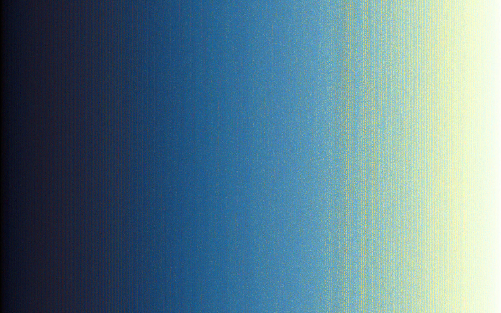

ColorShift
==========

ColorShift takes an image as a commandline argument in a .jpg, .gif, or .png format.

It then creates a new image that sorts the pixels in the image based on their respective average RGB values, in ascending order.

Here is an example:

